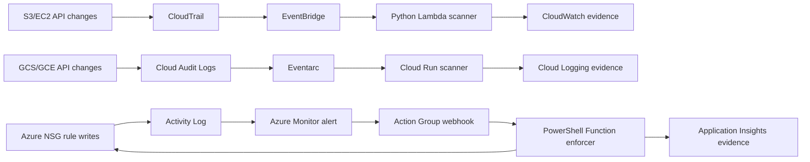

# Multi-Cloud Serverless Compliance Lab

Portfolio lab for event-driven compliance scanning across AWS, Azure, and GCP.

## Executive Summary

This project demonstrates automated compliance scanning and remediation across AWS, Azure, and GCP resources. The target portfolio metric is:

> Automated compliance scanning across multi-cloud lab resources and reduced manual audit time by 80%.

The 80% estimate is calculated as replacing a 10-hour weekly manual review of bucket, volume, firewall, VM, and NSG settings with a 2-hour evidence review of CloudWatch, Cloud Logging, and Application Insights logs.

## Architecture



## What This Shows

- AWS Lambda scanner detects public S3 exposure and unencrypted EC2 EBS volumes.
- GCP Cloud Run scanner detects public bucket IAM grants, Internet-open SSH/RDP firewall rules, and risky Compute Engine launches.
- Azure PowerShell Function remediates inbound SSH/RDP rules open to the Internet.
- EventBridge, CloudTrail, Cloud Audit Logs, Eventarc, Azure Activity Logs, Azure Monitor, and Application Insights provide evidence.
- IAM roles and Azure managed identities keep credentials out of code.
- Serverless execution avoids persistent audit infrastructure.

## Repository Structure

```text
aws-lambda-scanner/       Python Lambda, SAM template, IAM policy, sample events
azure-function-enforcer/  PowerShell Azure Function and webhook sample payload
gcp-cloudrun-scanner/     Python Cloud Run scanner, Dockerfile, sample audit events
docs/                     Architecture, lab guide, and security notes
scripts/                  Prereq checks and guarded metric-generation scripts
evidence/                 Redacted screenshots and CSV exports
```

Current sample evidence includes `evidence/azure-policy-enforced-sample.csv`, a redacted Application Insights export showing five NSG rules remediated from Internet-open SSH/RDP to the sanctioned lab source prefix.

## VS Code Setup

Open this folder in VS Code:

```powershell
code .
```

Install the recommended extensions when prompted. Then use the included tasks for AWS SSO login, SAM build/deploy, Azure login, local Azure Functions testing, and Git status.

Check local tools:

```powershell
.\scripts\check-prereqs.ps1
```

Useful VS Code tasks:

- `AWS: SSO login codex-admin`
- `AWS: SAM build`
- `Azure: Deploy NSG enforcer dry run`
- `Azure: Create dummy NSGs dry run`
- `Azure Functions: Run locally`
- `GCP: Verify active project`
- `GCP: Deploy Cloud Run scanner dry run`
- `GCP: Deploy Cloud Run scanner`
- `GCP: Query scanner logs`
- `GCP: Generate firewall evidence dry run`
- `GCP: Generate firewall evidence`

## Cloud+ Alignment

| Domain | Lab Evidence |
| --- | --- |
| Security | IAM least privilege, managed identity, S3/GCS public access checks, firewall detection, NSG remediation |
| Compliance | CloudTrail, EventBridge, Cloud Audit Logs, Eventarc, Activity Logs, Azure Monitor, evidence exports |
| Cost Optimization | Lambda and Azure Functions instead of always-on audit servers |
| Deployment | VS Code, Git, SAM, Azure Functions Core Tools, Google Cloud CLI |
| Troubleshooting | CloudWatch Logs, Application Insights, structured audit events |

## Safety

This lab intentionally creates insecure states for learning. Use only empty lab buckets, disposable compute resources, isolated GCP VPCs, and isolated Azure NSGs. Commit only redacted evidence. See `docs/security-notes.md`.

## Primary Docs

- AWS EventBridge rules for CloudTrail API events
- AWS Lambda execution roles and CloudWatch logging
- Google Cloud Audit Logs and Eventarc triggers
- Azure Functions PowerShell developer guide
- Azure Monitor Activity Log alerts and common alert schema
- Azure managed identity and scoped RBAC role assignments
