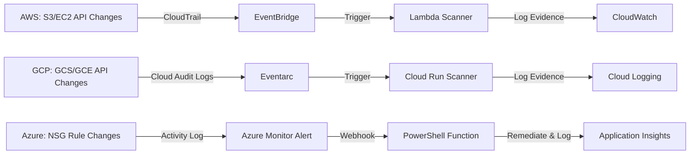

## What it does

This project automates compliance scanning and remediation across AWS, Azure, and GCP using serverless event-driven architecture. It detects security violations—like public S3 buckets, unencrypted EBS volumes, Internet-open firewall rules, and risky IAM grants—and remediates them automatically. Instead of manual weekly audits taking 10 hours, teams review evidence logs in 2 hours, reducing audit overhead by 80%.

## Architecture



## Stack


## Setup

1. **Prerequisites**
   - AWS account with SSO configured
   - Azure subscription with contributor access
   - GCP project with Compute and Storage APIs enabled
   - Python 3.9+, Node.js 14+, PowerShell 7+
   - AWS SAM CLI, Azure Functions Core Tools, Google Cloud CLI

2. **Check local environment**
   ```powershell
   .\scripts\check-prereqs.ps1
   ```

3. **Open in VS Code**
   ```powershell
   code .
   ```
   Install recommended extensions when prompted.

4. **Deploy AWS Lambda scanner**
   - Run VS Code task: `AWS: SSO login codex-admin`
   - Run VS Code task: `AWS: SAM build`
   - Deploy via CloudFormation or SAM CLI

5. **Deploy GCP Cloud Run scanner**
   - Run VS Code task: `GCP: Verify active project`
   - Run VS Code task: `GCP: Deploy Cloud Run scanner`

6. **Deploy Azure PowerShell Function**
   - Run VS Code task: `Azure: Deploy NSG enforcer dry run`
   - Review changes, then deploy to production

7. **Verify deployments**
   - AWS: Check CloudWatch Logs for `COMPLIANCE_VIOLATION` events
   - GCP: Run `GCP: Query scanner logs` task
   - Azure: Check Application Insights for remediation records

## Results / Metrics

- **Audit time reduction**: 80% (10 hours → 2 hours weekly)
- **Controls validated**: 5 across AWS, GCP, and Azure
- **AWS**: S3 public bucket detection, EC2 launch scanning
- **GCP**: Internet-open SSH/RDP firewall detection, public Cloud Storage IAM detection
- **Azure**: Internet-open SSH/RDP NSG rule remediation
- **Evidence**: Redacted CloudWatch, Cloud Logging, and Application Insights exports in `evidence/` directory
