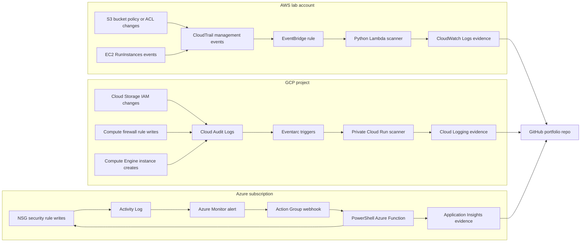

# Architecture Overview

This repository is a serverless compliance lab that detects or remediates intentionally unsafe lab changes across AWS, GCP, and Azure.

The design uses each cloud provider's native audit/event stream and serverless runtime instead of a persistent scanner VM.

## System Architecture

## Provider Roles

| Provider | Purpose | Evidence Destination |
| --- | --- | --- |
| AWS | Event-driven S3 exposure detection, with EC2 launch path documented as account-verification blocked | CloudWatch Logs |
| GCP | Event-driven Cloud Storage IAM and firewall exposure detection | Cloud Logging |
| Azure | Active remediation of Internet-open SSH/RDP NSG rules | Application Insights |

## Validated Controls

| Control | Status |
| --- | --- |
| AWS S3 public bucket policy detection | Validated |
| AWS EC2 launch scanning | Blocked by AWS account verification after dry-run viability |
| GCP public Cloud Storage IAM detection | Validated |
| GCP Internet-open SSH firewall detection | Validated |
| Azure Internet-open SSH/RDP NSG remediation | Validated |

## Design Intent

The lab demonstrates three practical cloud operations patterns:

- Detect risky configuration changes from audit events.
- Remediate unsafe network rules through an event-driven function.
- Preserve redacted evidence that can be reviewed without exposing account identifiers or secrets.

See `docs/architecture.md` for the focused provider-flow diagram and `docs/provider-pivot.md` for the AWS-to-GCP pivot narrative.
