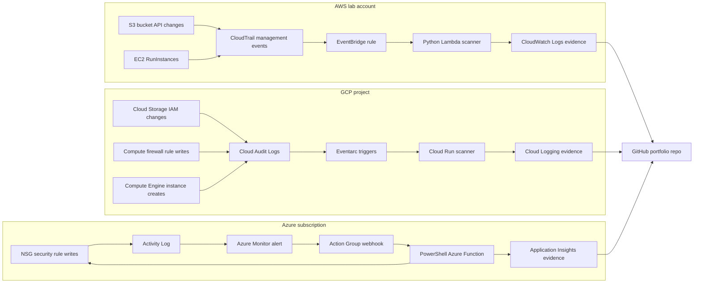

# Architecture

## Design Intent

This lab demonstrates event-driven compliance detection in AWS and GCP plus active remediation in Azure. It uses serverless services instead of a persistent audit VM to reduce cost and keep the operational surface area small.

## Security Boundaries

- Use a dedicated lab account/project/subscription or dedicated resource groups.
- Use least-privilege runtime identities for Lambda, Cloud Run, Eventarc, and Azure Functions.
- Store only redacted evidence in GitHub.
- Keep public bucket tests, open firewall rules, and open NSG rules limited to intentionally empty or isolated lab resources.
- Destroy or lock down lab resources after evidence is collected.
